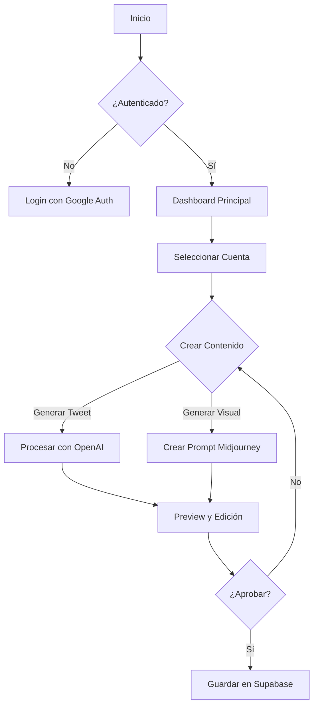
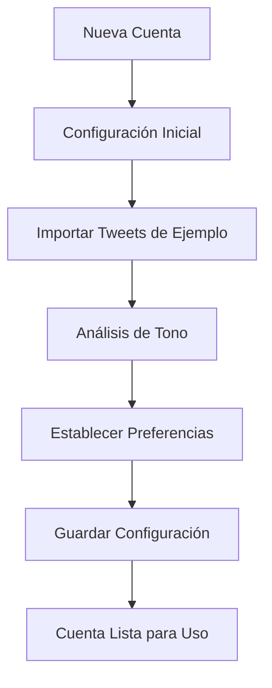
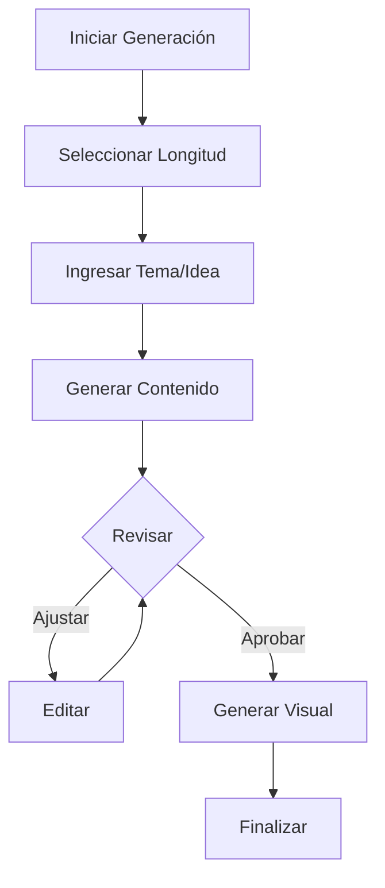

# Proyecto Twitter Content

## Visión General
Twitter Content es una plataforma avanzada diseñada para optimizar y automatizar la creación de contenido en Twitter. El proyecto combina tecnologías modernas de IA con una interfaz intuitiva para generar contenido que mantiene la autenticidad y el tono personal de cada cuenta.

## Diagramas de Flujo

### Flujo Principal de la Aplicación


### Flujo de Configuración de Cuenta


### Flujo de Generación de Contenido


## Instrucciones de Configuración

### Requisitos Previos
- Node.js y npm instalados
- Cuenta de Supabase
- Acceso a API de OpenAI
- Google Authenticator configurado

### Pasos de Instalación
1. Clonar el repositorio
```bash
git clone [URL del repositorio]
```

2. Instalar dependencias
```bash
npm install
```

3. Configurar variables de entorno
```bash
cp .env.example .env.local
# Editar .env.local con las credenciales necesarias
```

4. Iniciar el servidor de desarrollo
```bash
npm run dev
```

## Uso

### Autenticación
1. Acceder a la aplicación
2. Configurar Google Authenticator
3. Iniciar sesión con las credenciales proporcionadas

### Creación de Cuenta
1. Acceder al dashboard
2. Seleccionar "Nueva Cuenta"
3. Seguir el proceso de configuración
4. Importar tweets de ejemplo para análisis de tono

### Generación de Contenido
1. Seleccionar cuenta existente
2. Elegir opción de longitud de tweet
3. Ingresar tema o idea principal
4. Revisar y ajustar el contenido generado
5. Generar y vincular contenido visual con Midjourney

## Características Principales
- Generación de contenido basada en IA
- Mantenimiento de tono y estilo personal
- Integración con Midjourney para contenido visual
- Sistema de seguridad robusto
- Soporte para tweets de diferentes longitudes
- Interfaz intuitiva y responsiva

## Soporte
Para problemas o consultas, contactar al equipo de desarrollo.
